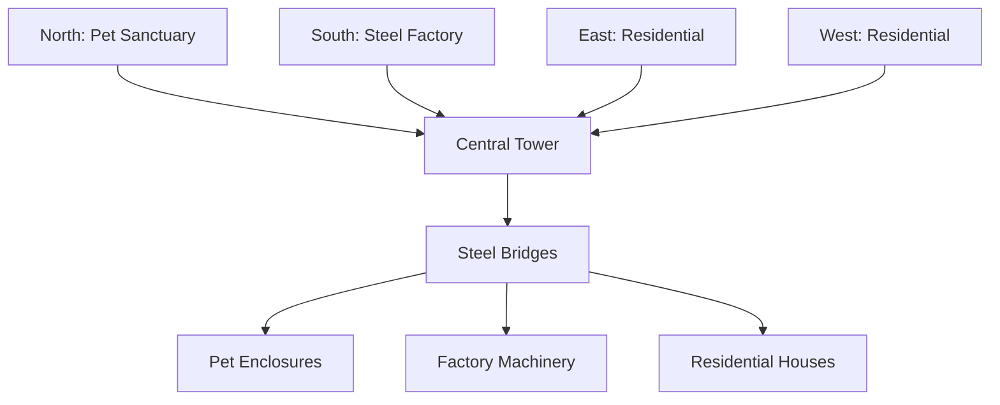

# Free Fire Craftland Map Plan: Pet Steel Style

## Overview
This plan outlines the design for a Free Fire Craftland map themed around "Pet Steel" - featuring steel structures and integrated pet elements. The map combines industrial steel aesthetics with cute pet animals to create a unique gameplay environment.

## Theme and Core Concept
- **Theme**: Industrial steel city with domesticated pets
- **Core Concept**: A futuristic pet sanctuary built entirely from steel, where players navigate through metallic structures while interacting with various animals
- **Visual Style**: Predominantly steel/metal blocks with occasional colorful accents for pet areas
- **Atmosphere**: Mix of industrial harshness and pet-friendly warmth

## Map Requirements (Based on Craftland Standards)
- **Size**: 150x150 blocks (standard large map)
- **Height Limit**: 50 blocks maximum
- **Block Types**: Focus on steel, iron, and metal variants; limited use of wood/stone for contrast
- **Animals**: Static decorative pets (dogs, cats, birds, etc.)
- **Interactive Elements**: Pressure plates, doors, basic traps
- **Spawn Points**: Multiple fair spawn locations
- **Objectives**: Custom objectives involving pet rescue and steel collection

## Overall Layout and Dimensions
```
Map Grid: 150x150
+-----------------------------------+
|          North: Pet Sanctuary     |
|  +-----------------------------+  |
|  |        Central Tower        |  |
|  |                             |  |
|  |                             |  |
|  +-----------------------------+  |
|          South: Steel Factory     |
+-----------------------------------+
```

### Zone Breakdown:
- **Central Tower Area** (50x50): Main landmark and objective hub
- **Pet Sanctuary** (North, 70x40): Animal enclosures and pet-themed structures
- **Steel Factory** (South, 70x40): Industrial buildings and machinery
- **Residential Districts** (East/West, 30x150 each): Smaller steel houses
- **Open Areas**: Connecting paths and exploration zones

### Terrain Features:
- Base terrain: Flat steel platform with decorative patterns
- Hills: Small elevated areas (max 10 blocks high) for strategic positioning
- Water features: Small ponds in pet areas for aesthetic
- Bridges: Steel walkways connecting elevated structures

## Key Buildings and Steel Structures

### 1. Central Steel Tower
- **Dimensions**: 20x20 base, 40 blocks high
- **Structure**: 
  - Base: Solid steel foundation
  - Middle: Open framework with platforms
  - Top: Observation deck with railings
- **Features**: 
  - Internal staircase
  - Multiple access points
  - Objective marker at top

### 2. Steel Factory Complex
- **Main Building**: 30x20x15 (LxWxH)
- **Features**:
  - Conveyor belt decorations (non-functional)
  - Chimney stacks
  - Loading docks
  - TNT storage areas (for traps)

### 3. Pet Sanctuary Buildings
- **Pet Houses**: Multiple 10x10x8 structures
- **Features**:
  - Steel cages with pet animals inside
  - Feeding stations
  - Play areas with toys

### 4. Residential Steel Houses
- **Dimensions**: 8x8x10 each
- **Features**:
  - Steel walls and roofs
  - Windows and doors
  - Small gardens with pets

### 5. Connecting Structures
- **Steel Bridges**: 20 blocks long, elevated 5 blocks
- **Walkways**: Narrow paths between buildings
- **Gates**: Automated doors for pet enclosures

## Pet Placements and Interactive Elements

### Pet Types and Locations:
- **Dogs**: 4-6 placed in central yard and residential areas
- **Cats**: 3-4 in sanctuary houses
- **Birds**: 2-3 on tower perches
- **Other**: Rabbits in garden areas

### Interactive Elements:
- **Pressure Plates**: Open pet cage doors
- **Levers**: Activate factory machinery (cosmetic)
- **Doors**: Steel gates that can be opened/closed
- **Pet Toys**: Decorative items that "activate" when stepped on

## Traps, Objectives, and Gameplay Mechanics

### Traps:
- **Spike Traps**: Around building perimeters
- **TNT Mines**: Hidden in factory area
- **Pitfalls**: Camouflaged holes in walkways
- **Swinging Hazards**: Pendulum blades in narrow passages

### Objectives:
1. **Pet Rescue**: Collect all pets from enclosures
2. **Steel Collection**: Gather steel items from factory
3. **Tower Conquest**: Reach the top of central tower
4. **Survival Challenge**: Last player standing with pet protection

### Gameplay Mechanics:
- **Spawn Balance**: Multiple spawn points distributed evenly
- **Loot Distribution**: Steel weapons/tools in factory, pet food in sanctuary
- **Time Limits**: Optional timed objectives
- **Team Mechanics**: Co-op pet rescue missions

## Building Steps in Craftland Studio

### Phase 1: Foundation
1. Set map size to 150x150
2. Create base steel platform
3. Add basic terrain variations

### Phase 2: Main Structures
1. Build central tower framework
2. Construct factory buildings
3. Add residential houses

### Phase 3: Details and Pets
1. Add decorative elements
2. Place pet animals
3. Install traps and interactive elements

### Phase 4: Testing and Balancing
1. Test spawn points
2. Balance difficulty
3. Add final touches

## Publishing Steps

### Preparation:
1. Ensure map meets Craftland guidelines
2. Test thoroughly in studio
3. Create compelling thumbnail and description

### Publishing Process:
1. Open Free Fire Craftland Studio
2. Load completed map
3. Select "Publish" option
4. Add title: "Pet Steel Sanctuary"
5. Add description highlighting pets and steel theme
6. Set appropriate tags (Pets, Steel, Industrial)
7. Choose visibility (Public/Private)
8. Confirm and publish

### Post-Publishing:
1. Share on social media
2. Gather community feedback
3. Plan updates based on player response

## Mermaid Diagram: Map Layout



This plan provides a comprehensive blueprint for creating a Pet Steel themed map in Free Fire Craftland. The combination of industrial steel structures with cute pet elements creates a unique and engaging gameplay experience.