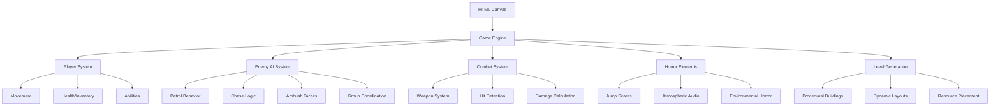

# Horror Game Architecture

## Game Concept
A web-based action horror game featuring realistic AI enemies in an urban setting. Players must survive waves of intelligent enemies using combat, stealth, and environmental tactics.

## System Architecture

## Key Components
- **Player System**: Health, weapons, stealth mechanics
- **AI System**: Believable enemy behaviors with state machines
- **Combat**: Real-time action with physics-based interactions
- **Horror Elements**: Tension building, scares, psychological effects
- **Level Generation**: Procedural urban environments for replayability