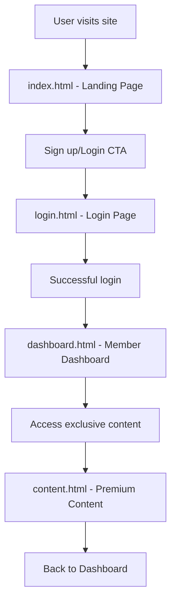

# Luxurious Membership Site Plan

## Overview
Create a full HTML-based luxurious membership site with the following components:
- Landing page showcasing membership benefits
- Login page for member access
- Member dashboard with personalized content
- Exclusive content sections for premium members

## Site Structure
- **index.html**: Landing page with hero section, membership tiers, benefits, testimonials, and sign-up CTA
- **login.html**: Login form with luxurious styling
- **dashboard.html**: Member dashboard showing account info, access to exclusive content
- **content.html**: Exclusive content page (e.g., premium articles, videos, or resources)

## Design Elements
- Luxurious color scheme: Gold, black, white gradients
- Elegant fonts: Serif for headings, sans-serif for body
- Responsive layout using CSS Grid/Flexbox
- Smooth animations and hover effects
- High-quality images and icons

## Features
- Basic login simulation (client-side, no backend)
- Dashboard with member stats and navigation
- Exclusive content gated behind login
- Mobile-responsive design

## Technologies
- HTML5 for structure
- CSS3 for styling (inline or linked)
- JavaScript for interactivity (login, dashboard updates)

## Workflow Diagram

## Todo List
- Define the site structure: landing page with hero and benefits, login page, member dashboard, and exclusive content sections
- Create HTML files: index.html (landing), login.html, dashboard.html, content.html
- Add CSS for luxurious styling (elegant fonts, gold/silver accents, gradients, responsive grid)
- Include JavaScript for basic login simulation, dashboard interactivity, and content access
- Add placeholder content for membership tiers, exclusive features, testimonials, and premium content
- Review and refine the design for attractiveness, usability, and mobile responsiveness